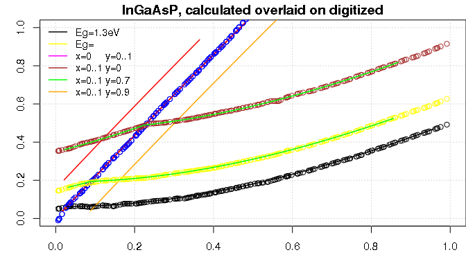

# README
Krzysztof Kłos  
July 5, 2017  

### Intro
This is the R package with model of bandgap(Eg) and strain in InGaAsP material based on paper:  
**J. Minch, S.H. Park, T. Keating, and S.L. Chuang: "Theory and Experiment if InGaAsP and AlInGaAs Long Wavelength Strained Quantum-Well Lasers" from Journal of Quantum Electronic vol 35, NO. 5, May 1999**

The model allows to transform Eg, Strain into molar fractions x(Ga), and y(As) and back:  
$Eg,Strain <--> x,y$
It was also used to exercise good coding practices in R:

- creating R packages
- documenting with Roxygen2 package
- writing unit tests with TestThat package
- using Rcpp for speed of C++
- using Boost C++ library
- writing R markdown documents
- continous integration principle with GitHub and Travis(Linux only)

### Installation
Type the commands below in R or RStudio, you could omit devtools if you already have it. 

`install.packages("devtools")`

`devtools::install_github("krzyklo/ingaasp2rcpp")`

The package location on GitHub: <https://github.com/krzyklo/ingaasp2rcpp>.

### Figures
The figures below shows digitized data (circles) and **InGaAsP calculator** results (lines) for $Eg,Strain <--> x,y$ transformations in both directions.

