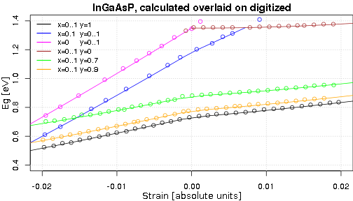
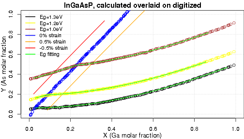

[](https://travis-ci.org/krzyklo/ingaasp2rcpp)

### Intro
This is the R package which ties model of bandgap(Eg) and strain vs x (Ga) and Y(As) molar fractions  in InGaAsP material. The model is based on paper:  
**J. Minch, S.H. Park, T. Keating, and S.L. Chuang: "Theory and Experiment if InGaAsP and AlInGaAs Long Wavelength Strained Quantum-Well Lasers" from Journal of Quantum Electronic vol 35, NO. 5, May 1999**

The model allows to transform Eg, Strain into molar fractions x(Ga), and y(As) and back:  
$Eg,Strain <--> x,y$  

The intention behind this was to exercise good coding practices in R:

- creating R packages
- documenting with Roxygen2 package
- writing unit tests with TestThat package
- using Rcpp for speed of C++
- using Boost C++ library
- writing R markdown documents
- continous integration principle with GitHub and Travis(Linux only)

### Installation
Type the commands below in R or RStudio:

`install.packages("devtools")`

`devtools::install_github("krzyklo/ingaasp2rcpp")`

The package location on GitHub: <https://github.com/krzyklo/ingaasp2rcpp>.

### Figures
The figures below shows digitized data (circles) and **InGaAsP calculator** results (lines) for $Eg,Strain <-> x,y$ transformations in both directions. As we could see below the model accurately reproduces the data from the figures in reference paper. 



The plot above shows the relation between bandgap Eg and strain of various InGaAsP composition variants. 
It was created by fixing x or y molar fractions, and then vary the other molar fraction between 0 and 1.
For example, InP material used as substrate have x=0 and y=0, and is located at 1.35 eV and 0 strain. InP location is at crossing point of two ternaries: magenta ($InAs_yP_{1-y}$) and brown ($In_{1-x}Ga_xP$) data series. For $InAs_yP_{1-y}$ by adding more As, the layer on InP substrate become compressively strained (negative sign of strain), and bandgap decrease, as we go toward InAs material.  
Adding Ga to InP would increase tensile strain (+ sign) of resulting ($In_{1-x}Ga_xP$), but bandgap Eg changes very little on the path toward GaP material.  
The black data series is $In_{1-x}Ga_xAs$ material, it shows the lowest limits of bandgap achievable in the InGaAsP compound, and it could be compressively or tensily strained.   
The 0 strain molar fractions for $In_{1-x}Ga_xAs$ are Ga=0.468, and bandgap of this InGaAs lattice matched to InP is 0.73 eV. 

```r
x<-round(ingaasp2rcpp::PQ_X_YStrain(1,0),digits=3)
round(PQ_Eg_XY(x,1),digits = 2)
```

```
## [1] 0.73
```




In the plot above we could see, two types of x and y relation. First for the cases where strain was fixed, and Eg was varied. The second where Eg was fixed, and strain varied. It need to be noted, that this plot is less straightforward to generate, as not all combinations of Eg and strain values have physical meaning (x and y values smaller than 1).
An example is Eg=0.7eV, and 0 strain. This pair is leading to y composition larger than 1.

```r
round(modPQ_XY_EgStrain(0.7,0),3)
```

```
##          X     Y
## [1,] 0.505 1.076
```

Constant strain lead to linear dependence between x and y molar fractions. In the plot 0% strain is shown with blue color, whereas -0.5% strain with red and 0.5% with orange. 


